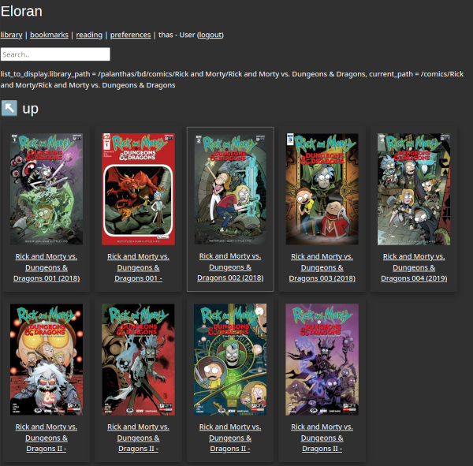
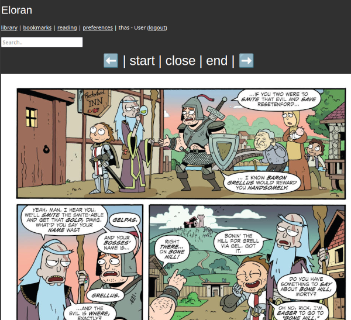

# Eloran

Comics and Ebook web library written in rust, with reading, search, reading status, bookmarks...

## Intro

I used [Ubooquity](https://vaemendis.net/ubooquity/) during a few years, but unfortunatly it is not opensource, and there is no read status, so I decided to find another solution.

I tried some alternatives :
- [Komga](https://komga.org) : best project here I think, but no "folder view" 😥
- [Tanoshi](https://github.com/faldez/tanoshi) ☠ : works well, in rust too 🦀🚀, but no support for ebooks
- [Calibre web](https://github.com/janeczku/calibre-web) or [BicBucStriim](https://github.com/rvolz/BicBucStriim) : I just can't use Calibre's classification system
- [Kavita](https://github.com/Kareadita/Kavita) : nice project too, but I don't like the Collections system (feels like Calibre)
- [Nextcloud epubreader](https://apps.nextcloud.com/apps/epubreader) : an old app, but it doesn't work with most of my collection

So here I am, a personal project named after my childrens ([Elora](https://en.wikipedia.org/wiki/Elora_Danan) and [Revan](https://en.wikipedia.org/wiki/Revan)).

Feel free to use, improve, and cry to my low code quality !

- use a sqlite database
- store ebooks and comcis covers in database (~10ko per cover, almost 160 Mo for 15000 files)
- multiple users, with bookmarks pages, reading status with page number (not for pdf), [argon2](https://en.wikipedia.org/wiki/Argon2) hashed password
- periodic scan of libraries folders
- no cached data, comics images are extracted on the fly
- comics pages responsive size for optimized mobile network usage
- small binary : 5 Mio, alpine based image : 13 Mio
- small css, small compressed svg, no javascript
- rust 🦀🚀

## Screenshots

CSS is a work in progress !



Navigation directly by clicking on the left or right of the comic page (red rectangles are obviously not visible...)



## Installation

Default login is `admin` / `admin`, then you need to add a new library path (`/library` if you use podman run command below)

### Podman / Docker

Feel free to customize listen port and path...

```
podman pull ghcr.io/thasos/eloran:latest
podman run -d -p 0.0.0.0:3200:3200 \
    -v /host_data/eloran/sqlite:/opt/eloran/sqlite \
    -v /host_data/library:/library \
    --name eloran \
    ghcr.io/thasos/eloran:latest
```


### From source

⚠ We use [SASS](https://sass-lang.com/documentation/) for the `css`, and [grass](https://github.com/connorskees/grass) to compile it, so you well need the binary.

```
git clone https://github.com/thasos/eloran.git
cd eloran
just build
target/x86_64-unknown-linux-gnu/release/eloran
```

If you don't use [just](https://github.com/casey/just), use it 😁 or just launch `cargo build --release` (see [justfile](./justfile) for exacts commands)

### Run dependencies

Nix
```
TODO
```

Arch
```
TODO
```

Debian/Ubuntu (tested with image `debian:sid-slim`)
```
sudo apt install libpoppler-glib8t64 libarchive13t64
```

Rpm style
```
TODO
```

### Build dependencies

Nix with [flakes](https://nixos.wiki/wiki/flakes) enabled :
```
nix develop
```

Arch :
```
sudo pacman -S libarchive cairo poppler-glib
yay -S grass-sass
# if you want to package it in alpine image
sudo pacman -S musl
```

Debian/Ubuntu (this part need an update) :
```
sudo apt install libarchive-dev libcairo2-dev libpoppler-glib-dev
# if you want to package it in alpine image
sudo apt install musl-dev
```

Rpm (this part need an update) :
```
sudo dnf install rust-glib-sys-devel.noarch
sudo dnf install rust-cairo-sys-rs0.16-devel.noarch
sudo dnf install cairo-gobject-devel.x86_64
sudo dnf install poppler-glib-devel.x86_64
sudo dnf install libarchive-devel.x86_64
```

## TODO

- [x] display read status
- [ ] add flags (read status and bookmark) to folder
- [x] hash password in database !!
- [ ] store session in database (see `fn create_router()` in [src/http_server.rs](http_server.rs))
- [ ] pretty error handling
- [x] more testing
- [ ] allow relative path in `library_path`
- [x] fix element numbers for sub directories
- [ ] handle `cover.jpg` files for directories (or use first file's cover ?)
- [x] customized css
- [ ] upload files
- [ ] install page at 1st start : admin password, library_path, new user...
- [ ] share files (or directories, or page)
- [ ] grid or list view in preferences
- [ ] progress bar while reading, file info, and grid view
- [ ] easy go to page number while reading and from file info
- [x] read pdf in new tab
- [x] better css 🤪
- [ ] true ebook reading
- [ ] export read status
- [ ] list "next to read"
